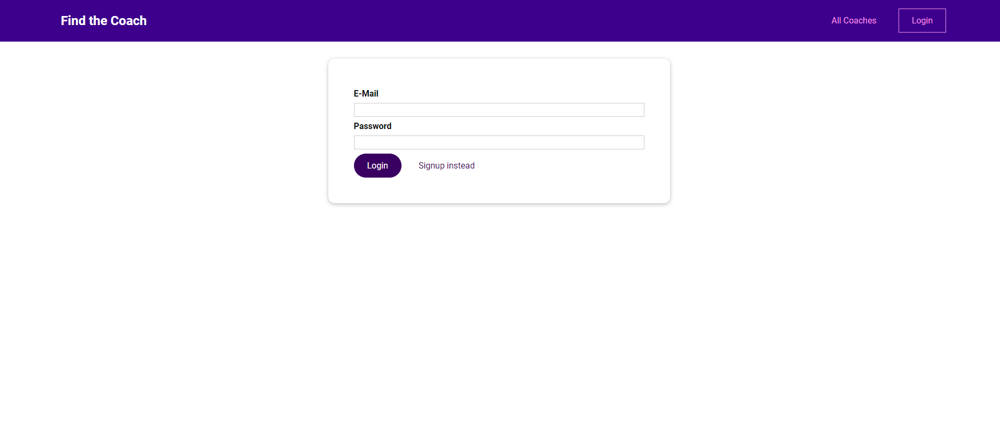
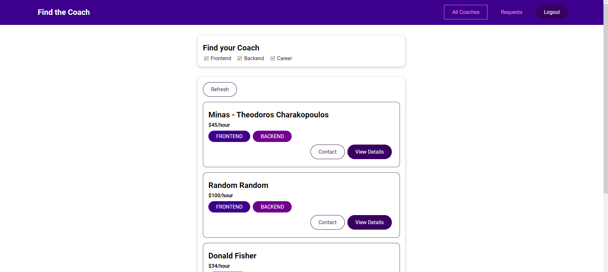

# Coach App - Find your coach!
<h3>This is front-end website where someone can see coaches or register/login as coach</h3>
Done as part of the Udemy course called "Vue - The Complete Guide (incl. Router & Composition API)" by Maximilian Schwarzmüller<br><br>





# Tools and services used
<ul>
<li><b>Vue3</b></li>
<li><b>Vue Router</b></li>
<li><b>Vue Store</b></li>
<li><b>Firebase</b></li>
</ul>

# Local Installation
```
Download the zip from github and extract it
Import Coach App root folder to vscode
Confirm you are on "Coach App" directory
npm install
npm run serve
Follow the server link that provided after build
```

# Live
https://coach-vue-app-f9877.web.app/coaches
